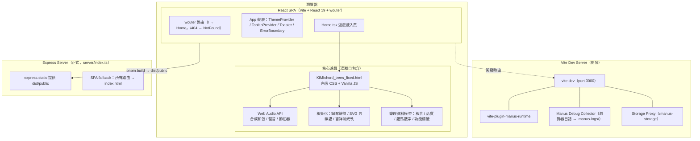

# 韶韻音樂學院 馬老師 專門設計給秀玲姊練習和弦樂理的程式（Chordtrain）

以瀏覽器呈現的**樂理和弦教學遊戲**，將和弦知識視覺化為一棵棵可互動、可聆聽的「和弦樹」。本專案為高保真複刻並重構自 [chord-trees.nathanielschool.com](https://chord-trees.nathanielschool.com/) 的音樂教育工具，歷經 18 個版本的迭代修正，以繁體中文介面呈現。

## 專案簡介

KIMIchord 和弦樹遊戲把抽象的和聲學轉換成直覺的視覺與聽覺體驗：

- **三種學習難度**：初學者（Beginner，單音根音節點樹）、調內（Diatonic，調性音級與調內和弦）、中級（Intermediate，依 Major／Minor／Dominant 7th／Major 7th／Minor 7th／Diminished／Augmented 及延伸和弦分類的節點卡）。
- **即時音訊合成**：以 Web Audio API 直接產生和弦、琶音與節拍器聲音，不依賴任何外部音訊檔；支援樂器音色、和弦／琶音音量、速度（30–300 BPM）、循環次數與 MIDI 匯出。
- **雙重視覺化**：真實鋼琴排列（白鍵／黑鍵）的迷你鍵盤，以及符合標準高音譜表（G4 於第二線）的五線譜渲染，支援升降記號與三度堆疊的全音符和弦。
- **播放與互動**：播放、循環、隨機和弦、生成進行、智慧化和聲；吉祥物會沿播放路徑移動，留下白色 5px 弧線光軌與粒子效果並淡出。
- **主題系統**：原有淺灰（Earth）、莫蘭迪、海洋、深色四套色系，支援響應式版面（手機直式／橫式安全版面）。
- **快捷鍵**：Space（播放）、M／L／R／G（旋律轉和弦等）、Esc（關閉）。
- **教學歸屬**：頁尾保留「韶韻音樂學院 馬老師 專門為秀玲姊設計 和弦系統教學」版權宣告。

核心遊戲為**單一自包含 HTML 檔案**（`client/public/KIMIchord_trees_fixed.html`，約 80 KB，內嵌全部 CSS／JavaScript，無外部資料依賴），外層以 React + Vite + Express 提供開發與正式環境的殼層。

## 架構圖 (Architecture Diagram)



## 專案結構

```
chordtrain/
├── client/                          # React 前端（Vite root）
│   ├── index.html                   # SPA 入口
│   ├── public/
│   │   ├── KIMIchord_trees_fixed.html   # ★ 核心遊戲：單檔自包含 HTML+CSS+JS
│   │   └── __manus__/               # 開發用除錯收集器（version.json 由 .gitignore 排除）
│   └── src/
│       ├── main.tsx / App.tsx       # 應用入口與路由殼層
│       ├── const.ts / index.css     # 共用常數與 Tailwind 樣式
│       ├── pages/                   # Home（嵌入遊戲 iframe）、NotFound
│       ├── components/              # ErrorBoundary、ManusDialog、Map 與 ui/（shadcn/ui，60+ 元件）
│       ├── contexts/ThemeContext.tsx
│       └── hooks/                   # useComposition / useMobile / usePersistFn
├── server/
│   └── index.ts                     # Express 正式伺服器：靜態伺服 + SPA fallback
├── shared/
│   └── const.ts                     # 前後端共用常數
├── patches/
│   └── wouter@3.7.1.patch           # pnpm patchedDependencies
├── dist/                            # 建置輸出（.gitignore 排除，dist/index.js 為已建置伺服器）
├── todo.md                          # 第二版～第十八版修正待辦與驗收
├── verification-notes.md            # 第十一版～第十八版逐版驗證筆記
├── replication-notes.md             # 原站複刻 ground-truth 筆記（2026-08-12）
├── ideas.md                         # 設計基準（ground-truth design brief）
├── research_staff.md                # 五線譜定位依據（Wikipedia / Puget Sound）
├── template.json                    # Manus 樣板定義
├── fix_mascot_template.py           # 吉祥物 SVG 樣板修正腳本
├── patch_mascot_feature.py          # 吉祥物功能修補腳本
├── vite.config.ts                   # Vite 設定（插件、路徑別名、建置輸出）
├── package.json / pnpm-lock.yaml    # 依賴與鎖定（pnpm 10.4.1）
└── tsconfig.json / tsconfig.node.json
```

## 使用說明

### 環境需求

- Node.js ≥ 20（建議 24）
- pnpm 10（`corepack enable` 後依 `packageManager` 欄位自動取得）

### 安裝與啟動

```bash
# 1. 安裝依賴
pnpm install

# 2. 開發模式（Vite dev server，預設 http://localhost:3000）
pnpm dev

# 3. 型別檢查
pnpm run check

# 4. 建置（輸出前端至 dist/public，後端 bundle 至 dist/index.js）
pnpm run build

# 5. 正式模式（Express 伺服器提供靜態檔案，預設 port 3000）
pnpm start
```

### 遊戲操作

1. 左上角選擇難度：**初學者**（四個根音節點樹）、**調內**（選擇 KEY／SCALE／MODE，顯示 I–vii° 調內和弦）、**中級**（15 種和弦分類，延伸和聲可折疊）。
2. 左側設定欄：音符數、Random／Manual、Generate、Play、智慧化和聲、隨機和弦、樂器、和弦／琶音音量、速度 30–300 BPM、節拍器、琶音（四分音符／十六分音符）、循環 1x／2x／4x、MIDI 匯出、錄音。
3. 點擊和弦節點即可播放並加入進行；鋼琴鍵盤與五線譜會即時顯示完整和弦音。
4. 右上角：Earth 主題選單（原有淺灰／莫蘭迪／海洋）、月亮深色模式、問號操作說明。
5. 快捷鍵：Space 播放、M／L／R／G 功能鍵、Esc 關閉視窗。

### GitHub Pages

線上版本見 [aymimensa.github.io/Chordtrain/](https://aymimensa.github.io/Chordtrain/),由 GitHub Actions 自動部署（[.github/workflows/deploy-pages.yml](.github/workflows/deploy-pages.yml)）:每次推送至 `main` 時執行型別檢查 → `pnpm build`（`VITE_BASE=/Chordtrain/`）→ 上傳 `dist/public` 至 GitHub Pages。

靜態部署時僅需 `client/public/KIMIchord_trees_fixed.html` 一個檔案即可完整運行（純前端、Web Audio、無後端依賴）。

## 更新歷史 (Date Sorted)

> 日期錨點：原站複刻驗證筆記為 **2026-08-12**；第十八版（最終）檔案時間戳為 **2026-08-21**。第二～十三版無精確日期紀錄，以下以版本順序（即時序）標示約略日期。

| 日期 | 版本 | 內容 |
|---|---|---|
| 約 2026-07 下旬 | v1–v2 | 初始複刻；比對原站修正背景與品牌資產、五線譜音符與音名位置 |
| 約 2026-07 下旬 | v3–v8 | 高音譜號依 Wikipedia 標準定位（G4 第二線）並逐版微調尺寸；三度音符同 x 座標垂直堆疊 |
| 約 2026-08 上旬 | v9 | 吉祥物跟隨播放中的和弦移動，留下 5px 白色軌跡，5 秒淡出 |
| 約 2026-08 上旬 | v10 | 播放觸發修正：手動點擊不觸發吉祥物；播放開始前同步和弦畫面 |
| 約 2026-08 上旬 | v11 | 和弦畫面同步；光軌與五線譜樂理修正（依音名字母＋升降記號正確排譜） |
| 約 2026-08 上旬 | v12 | 光軌可見性修正：建立即完整可見再淡出；halo 光暈強化短距離移動辨識 |
| 約 2026-08 上旬 | v13 | 吉祥物固定於視窗定位（不受捲軸拖曳影響）；光柱統一 5px 白線 |
| 2026-08-12 | 重構 | 原站高保真複刻與完整功能重構：Beginner／Diatonic／Intermediate 三難度資料模型、Web Audio 播放引擎、繁中介面翻譯（[replication-notes.md](replication-notes.md)） |
| 約 2026-08 中旬 | v14 | 調內完整和弦五線譜、八分／十六分音符琶音排程、Earth 三色系主題、繁中操作說明 modal |
| 約 2026-08 中旬 | v15 | 月亮按鈕全畫面深色模式；點擊和弦即時同步鋼琴與五線譜雙視覺化 |
| 約 2026-08 中旬 | v16 | Earth 還原白色背景；加入韶韻音樂學院版權頁尾；琶音改四分音符並依 BPM 排程 |
| 約 2026-08 中旬 | v17 | 光軌改二次貝茲弧線＋粒子；節拍器預設 72 BPM、第一拍木魚重音；琶音 0% 靜音 |
| 2026-08-21 | v18 | Earth 淺灰背景強化白色光軌對比；圓弧光軌外加淡出粒子效果；通過型別檢查與 production build |
| 2026-09-14 | 部署 | 開源至 GitHub 並上線 GitHub Pages：新增 Actions 自動部署工作流；vite 加入 `VITE_BASE` 子路徑支援、iframe 改用 `BASE_URL` 相對路徑，確保專案站 `/Chordtrain/` 下完整運行 |

## 相關連結

- 線上遊戲：https://aymimensa.github.io/Chordtrain/
- 原始參考：https://chord-trees.nathanielschool.com/
- 姊妹專案（D3.js 樂理心智圖）：https://aymimensa.github.io/ChordTree/

## 授權

MIT License
